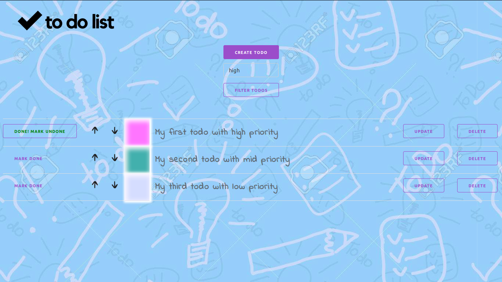

<h1 align="center">Getting things done</h1>

<h1 align="center">Manage and track your daily tasks</h1>

This app is as simple as to-do list apps come. It’s a gorgeously minimal app that does exactly what it’s supposed to and no more. You can create tasks, update, delete, mark tasks with done - undone, set priority, filter by priority and move tasks up or down.

<h2>Demo</h2>
  
<h2>Getting started</h2>

<h2>How to run</h2>

Clone the source locally:

<pre> 
      $ git clone https://github.com/alexshchegretsov/TODO_manager.git
      $ cd TODO_manager
</pre>

Run containers with `docker-compose` tool:

<pre>
      $ docker-compose up -d
</pre>

Initialize postgres and collect staticfiles:

<pre>
      $ docker-compose run --rm web ./manage.py migrate
      $ docker-compose run --rm web ./manage.py collectstatic    (type "yes")
</pre>

Open your browser in a new window and go to localhost on 8000 port:

<pre>
      http://127.0.0.1:8000/
</pre>

<h2>Built with</h2>
<ul>
  <li><a href="https://www.djangoproject.com/">Django</a> - The web framework used</li>
  <li><a href="https://milligram.io/">Milligram</a> - A minimalist CSS framework</li>
</ul>
<h2>License</h2>

FREE &copy; <a href="https://github.com/alexshchegretsov">Alex Shchegretsov</a>

